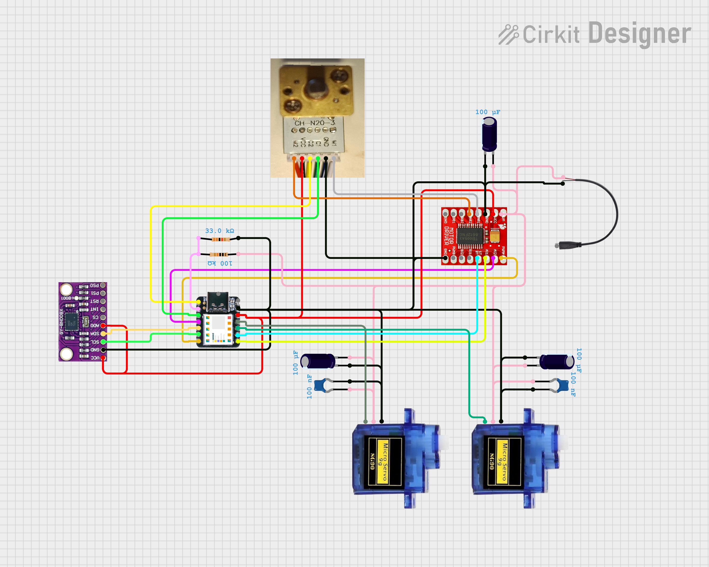
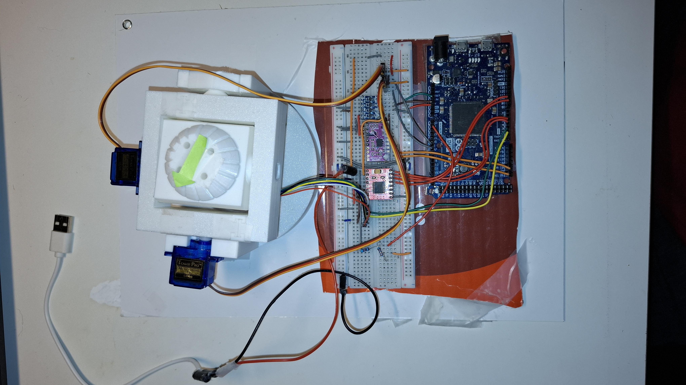

# GyroVisor
A gimbal suspended north pointing visor.  It is a cardanic suspension build on a base plate, with two "rings" an outer ring, which is rotating around an axis , suspended on two bearings on the the perimeter of the ring at 180 degree. The rotation angle is controlled by an servo motor on one of the two bearings. Then in the inside of this ring there is another ring, which is also rotating, but the rotating axis is at 90 degree to the rotation axis of the outer ring. Also here the rotation angle is controlled by an servo motor on one of the two bearings. Then, in the inside of this inner ring is a motor, which can rotate freely, and it is has an encoder. On this motor axle, an round platform with an arrow (or a camera) is mounted. There is a electronic circuit, which is fixed on the base plate. So, when the base platform is mounted on a irregularly moving vehicle, gondola, vessel or airplane, the circuit is designed to control the two servo motors and the motor with encoder so that the arrow always stays horizontally, and the arrow (or camera) on the platform always points to the same direction, always compensating the movements of the airplane. This is commonly known as a "gimbal".

Circuit diagram

# Stl parts:

http://raikkulenz.kapsi.fi/downloadfolder_not_protected/stl.zip 

# picture how the different stl parts look like 

http://raikkulenz.kapsi.fi/downloadfolder_not_protected/parts_stl.pdf 

# picture of the whole GyroVisor
http://raikkulenz.kapsi.fi/downloadfolder_not_protected/kokonaiskuva.pdf

# Photo

# demo video link

# Shopping list link collection

https://linktr.ee/Gyrovisor_gimbal

# **Circuit Documentation**

## **Summary**

This circuit is designed to control a motor using an Arduino UNO, a TB6612FNG motor driver, and a motor with an encoder. The circuit also includes a logic level converter, a BNO055 sensor, and a PWM servo breakout board to control servos. The Arduino UNO reads the encoder values to control the motor's position using a proportional control algorithm. The circuit is powered via a USB C connection.

## **Component List**

1. **TB6612FNG Motor Driver**  
   * Description: Motor driver for controlling DC motors.  
   * Pins: GND, B01, B02, A02, A01, VCC, VM, PWMB, BI2, BI1, STBY, AI1, AI2, PWMA  
2. **Motor N20 with Encoder**  
   * Description: DC motor with an integrated encoder for feedback.  
   * Pins: Red:M2, Black:VCC, Yellow:C2, Green:C1, Blue:GND, White:M1  
3. **USB C to 2 fils**  
   * Description: Power supply interface.  
   * Pins: USB C, \+, \-  
4. **Resistor (33k Ohms)**  
   * Description: Resistor with a resistance of 33k Ohms.  
   * Pins: pin1, pin2  
5. **Micro Servo 9G (x2)**  
   * Description: Small servo motor for precise control.  
   * Pins: GND, \+5V, PWM  
6. **BNO085**  
   * Description: 9-axis sensor for motion tracking.  
   * Pins: VCC, GND, SCL/SCK/RX, SDA/MISO/TX, ADR/MOSI, CS, INT, RST, PS1, PS0  
7. **Electrolytic Capacitor (0.1 mF) (x3)**  
   * Description: Capacitor for smoothing voltage.  
   * Pins: \-, \+  
8. **Ceramic Capacitor (0.1 µF) (x2)**  
   * Description: Capacitor for filtering high-frequency noise.  
   * Pins: pin0, pin1  
9. **Seeeduino XIAO**  
   * Description: Compact microcontroller for processing and control.  
   * Pins: A0 \- D0 \- DAC, A1 \- D1, A2 \- D2, A3 \- D3, A4 \- D4 \- SDA, A5 \- D5 \- SCL, A6 \- D6 \- TX, 5V, GND, 3V3, A10 \- D10 \- MOSI, A9 \- D9 \- MISO, A8 \- D8 \- SCK, A7 \- D7 \- RX  
10. **Resistor (100k Ohms)**  
    * Description: Resistor with a resistance of 100k Ohms.  
    * Pins: pin1, pin2

## **Wiring Details**

### **TB6612FNG Motor Driver**

* **VCC** is connected to the 3V3 pin of the Seeeduino XIAO and the VCC pin of the BNO085.  
* **GND** is connected to the ground net shared with multiple components.  
* **STBY** is connected to the A8 \- D8 \- SCK pin of the Seeeduino XIAO.  
* **PWMA** is connected to the A6 \- D6 \- TX pin of the Seeeduino XIAO.  
* **AI1** is connected to the A7 \- D7 \- RX pin of the Seeeduino XIAO.  
* **AI2** is connected to the A3 \- D3 pin of the Seeeduino XIAO.  
* **A02** is connected to the Red:M2 pin of the motor N20 with encoder.  
* **A01** is connected to the White:M1 pin of the motor N20 with encoder.  
* **VM** is connected to the positive power net shared with the USB C and other components.

### **Motor N20 with Encoder**

* **Red:M2** is connected to the A02 pin of the TB6612FNG Motor Driver.  
* **White:M1** is connected to the A01 pin of the TB6612FNG Motor Driver.  
* **Black:VCC** is connected to the 3V3 pin of the Seeeduino XIAO.  
* **Blue:GND** is connected to the ground net.  
* **Yellow:C2** is connected to the A0 \- D0 \- DAC pin of the Seeeduino XIAO.  
* **Green:C1** is connected to the A2 \- D2 pin of the Seeeduino XIAO.

### **USB C to 2 fils**

* **\+** is connected to the positive power net shared with the VM pin of the TB6612FNG Motor Driver.  
* **\-** is connected to the ground net.

### **Resistor (33k Ohms)**

* **pin1** is connected to the A1 \- D1 pin of the Seeeduino XIAO.  
* **pin2** is connected to the ground net.

### **Micro Servo 9G**

* **GND** is connected to the ground net.  
* **\+5V** is connected to the positive power net.  
* **PWM** of the first servo is connected to the A10 \- D10 \- MOSI pin of the Seeeduino XIAO.  
* **PWM** of the second servo is connected to the A9 \- D9 \- MISO pin of the Seeeduino XIAO.

### **BNO085**

* **VCC** is connected to the 3V3 pin of the Seeeduino XIAO.  
* **GND** is connected to the ground net.  
* **SCL/SCK/RX** is connected to the A5 \- D5 \- SCL pin of the Seeeduino XIAO.  
* **SDA/MISO/TX** is connected to the A4 \- D4 \- SDA pin of the Seeeduino XIAO.

### **Electrolytic Capacitors**

* **\+** pins are connected to the positive power net.  
* **\-** pins are connected to the ground net.

### **Ceramic Capacitors**

* **pin0** is connected to the positive power net.  
* **pin1** is connected to the ground net.

### **Seeeduino XIAO**

* **3V3** is connected to the VCC pin of the BNO085 and the Black:VCC pin of the motor N20 with encoder.  
* **GND** is connected to the ground net.  
* **A0 \- D0 \- DAC** is connected to the Yellow:C2 pin of the motor N20 with encoder.  
* **A1 \- D1** is connected to pin1 of the 33k Ohm resistor.  
* **A2 \- D2** is connected to the Green:C1 pin of the motor N20 with encoder.  
* **A3 \- D3** is connected to the AI2 pin of the TB6612FNG Motor Driver.  
* **A4 \- D4 \- SDA** is connected to the SDA/MISO/TX pin of the BNO085.  
* **A5 \- D5 \- SCL** is connected to the SCL/SCK/RX pin of the BNO085.  
* **A6 \- D6 \- TX** is connected to the PWMA pin of the TB6612FNG Motor Driver.  
* **A7 \- D7 \- RX** is connected to the AI1 pin of the TB6612FNG Motor Driver.  
* **A8 \- D8 \- SCK** is connected to the STBY pin of the TB6612FNG Motor Driver.  
* **A9 \- D9 \- MISO** is connected to the PWM pin of the second Micro Servo 9G.  
* **A10 \- D10 \- MOSI** is connected to the PWM pin of the first Micro Servo 9G.

### **Resistor (100k Ohms)**

* **pin1** is connected to the positive power net.  
* **pin2** is connected to pin2 of the 33k Ohm resistor.

## **Code Documentation**

The Seeeduino XIAO is programmed to control the motor driver, read encoder feedback, and manage the servos and sensor data. The logic level converter ensures proper voltage levels between the Arduino and the BNO085 sensor. The code integrates motor positioning, servo actuation, and orientation sensing into a single real‑time control loop.
The Compass class handles all orientation processing from the BNO085. Incoming quaternion data from various SH2 sensor report types (Rotation Vector, Game Rotation Vector, and Gyro‑Integrated Rotation Vector) is converted into Euler angles using quaternion mathematics. The class updates yaw, pitch, and roll values and provides convenience functions for computing heading relative to magnetic north. The conversion logic uses trigonometric functions to derive Euler angles and supports both radians and degrees.
In the main program, the Seeeduino XIAO initializes the motor driver (TB6612FNG) and monitors its supply voltage through a resistor divider. It reads the rotary encoder to track the motor’s current position and compares it with a continuously integrated heading that represents total rotation. A proportional controller converts position error into PWM output to drive the motor forwards or backwards. A dead‑zone prevents unnecessary oscillation when the motor is near its target.
The BNO085 IMU is polled for new orientation data; when new sensor events arrive, the Compass class updates its internal state. Pitch and roll values are used to position two servos, allowing the system to physically reflect the sensor’s orientation. The loop runs continuously, coordinating motor control, orientation tracking, and servo movement to maintain synchronized and smooth operation.

## **Libraries used**

  sparkfun/SparkFun BNO08x Cortex Based IMU@^1.0.6
  arduino-libraries/Servo@^1.3.0
	paulstoffregen/Encoder@^1.4.4

## **Testing**

The python program called protocoling_error.py was used to make a diagram of the error between target and measured  encoder value.

Such a protocol can be used to optimize the PID parameters.

## **Ursina visualization**

The python program called imu_visualizer.py  was used to generate a stylized 3D model of the device on the screen to verify the correctness of the IMU sensor signals. You can see it in the YouTube demo video linked above. To do this, the currently commented-out command lines inside Compass.cpp (74-79), /* Serial.print("X: "); Serial.print(ypr_1.yaw); etc., must be enabled (i.e., the /* */ must be removed), and other Serial.print commands may need to be disabled.

